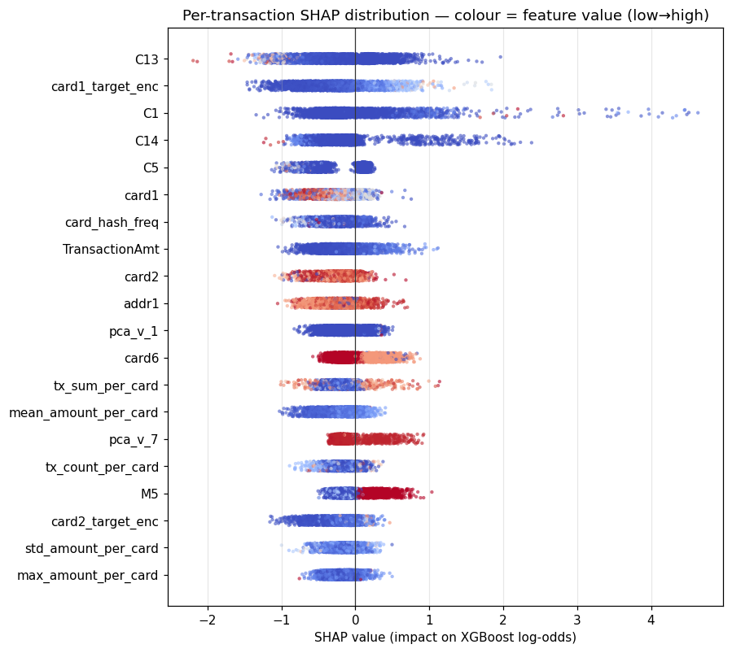
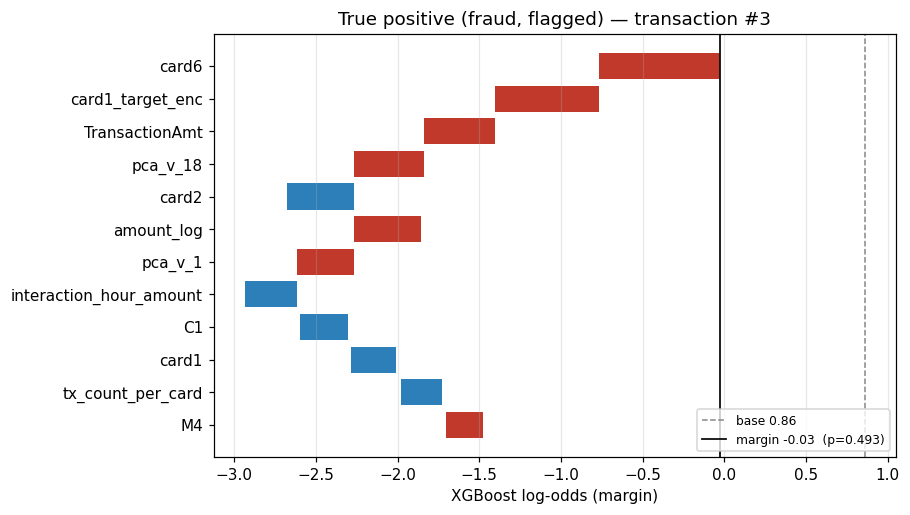

# Fraud-XAI

Explainable, production-shaped fraud detection on the IEEE-CIS transaction dataset — a 3-way **XGBoost + Temporal Fusion Transformer + LightGBM** ensemble, served over **FastAPI**, explained with **SHAP**, streamed through **Kafka**, and monitored with **Prometheus + Grafana + Evidently AI**.

This is a portfolio project built to demonstrate the full lifecycle a fintech ML role actually requires: leakage-audited time-based data splitting, class-imbalance handling, regulatory-grade per-prediction explanations, sub-second serving, real-time stream simulation, drift detection, and business-cost-driven threshold selection — not just a notebook with a model.

## Table of Contents

- [Architecture](#architecture)
- [Quick Start](#quick-start)
- [API Usage](#api-usage)
- [Results](#results)
- [Explainability](#explainability)
- [Monitoring](#monitoring)
- [Project Structure](#project-structure)
- [Technical Decisions](#technical-decisions)
- [Dataset](#dataset)
- [Testing](#testing)
- [Known Limitations](#known-limitations)

## Architecture

```
┌──────────────────────────────────────────────────────────────────────┐
│  DATA LAYER                                                          │
│  IEEE-CIS CSV → time-sorted (TransactionDT) → feature engineering    │
│  → 70/10/20 time-based train/val/test split (no shuffle)             │
└───────────────────────────────┬────────────────────────────────────┘
                                 │
                  ┌──────────────▼──────────────┐
                  │  TRAINING LAYER              │
                  │  XGBoost (scale_pos_weight)  │
                  │  LightGBM                    │
                  │  TFT (Focal Loss, PyTorch    │
                  │       Forecasting)           │
                  │  MLflow experiment tracking  │
                  └──────────────┬──────────────┘
                                 │
                  ┌──────────────▼──────────────┐
                  │  EXPLAINABILITY LAYER        │
                  │  SHAP TreeExplainer (XGB)    │
                  │  Beeswarm / waterfall plots  │
                  └──────────────┬──────────────┘
                                 │
┌────────────────────────────────▼───────────────────────────────────┐
│  SERVING LAYER — Docker: fraud-api                                  │
│                                                                      │
│  FastAPI  POST /predict · GET /health · GET /metrics                │
│  → ensemble score (XGB + TFT + LightGBM, weighted blend)            │
│  → SHAP explanation attached per response                           │
│  → structured JSON request/response log                             │
│                                                                      │
│  [asyncio background task, same process]                            │
│  Kafka consumer: transactions → score → fraud_alerts                │
└────────────────────────────────┬───────────────────────────────────┘
                                 │
                  ┌──────────────▼──────────────┐
                  │  Docker: kafka (KRaft mode)  │
                  └──────────────┬──────────────┘
                                 │
┌────────────────────────────────▼───────────────────────────────────┐
│  MONITORING LAYER                                                    │
│  Evidently AI drift reports  ·  Prometheus  ·  Grafana dashboards    │
└──────────────────────────────────────────────────────────────────────┘
```

**Docker Compose runs exactly 4 services**: `fraud-api` (FastAPI + Kafka consumer background task), `kafka` (KRaft mode, no Zookeeper), `prometheus`, `grafana`. MLflow and the Kafka producer are one-shot local commands, not containers — see [Quick Start](#quick-start).

## Quick Start

```bash
git clone <repo-url>
cd fraud-xai-trial
conda create -n fraudx python=3.10 -y && conda activate fraudx

make setup                 # pip install + pre-commit hooks
make data                  # download IEEE-CIS, run preprocessing → data/processed/
make train                 # train XGBoost, TFT, LightGBM; log to MLflow
make ensemble PROMOTE=1    # fit + freeze the deployed 3-way blend → models/ensemble.json

make serve                 # uvicorn src.api.main:app --reload  (http://localhost:8000)
# or, full stack:
make docker-up             # fraud-api + kafka + prometheus + grafana
```

Simulate a live transaction stream against the running API:

```bash
make stream                # python src/streaming/producer.py --rate 200 --limit 5000
```

Inspect training runs locally:

```bash
make mlflow                 # mlflow ui --backend-store-uri ./mlruns --port 5000
```

## API Usage

Interactive docs at `http://localhost:8000/docs` (auto-generated OpenAPI/Swagger UI).

```bash
curl -X POST http://localhost:8000/predict \
  -H "Content-Type: application/json" \
  -d '{
    "TransactionID": "3663549",
    "TransactionDT": 13000000,
    "TransactionAmt": 125.50,
    "card1": 13926
  }'
```

```json
{
  "transaction_id": "3663549",
  "fraud_probability": 0.0421,
  "decision": "LEGITIMATE",
  "threshold": 0.012831,
  "model_version": "a58c639797622173-9d647d076538a1c0-f73b8af",
  "mode": "ensemble",
  "degraded": false,
  "model_probabilities": {"xgb": 0.038, "tft": 0.061, "lgbm": 0.045},
  "explanation": [
    {"feature": "amount_vs_mean_ratio", "contribution": 0.014},
    {"feature": "card_fraud_rate_30d", "contribution": 0.009},
    {"feature": "hour_sin", "contribution": -0.003}
  ],
  "explained_model": "xgb",
  "explained_weight": 0.618,
  "latency_ms": 512.3
}
```

Only `TransactionID`, `TransactionDT`, `TransactionAmt`, and `card1` are validated explicitly; the remaining ~430 IEEE-CIS raw columns (`V1`–`V339`, `C1`–`C14`, `D1`–`D15`, `id_*`, `M1`–`M9`) are accepted but optional. `GET /health` reports model load state and Kafka consumer status; `GET /metrics` exposes Prometheus counters (request count, latency, fraud rate, model version).

## Results

Final deployed model: a validation-weighted blend of XGBoost, TFT, and LightGBM, evaluated on a held-out, time-ordered test set (118,109 transactions, 3.44% fraud rate) never touched during training or threshold selection.

| Model | Test PR-AUC | Test ROC-AUC |
|---|---|---|
| XGBoost (standalone) | 0.5382 | 0.9091 |
| LightGBM (standalone) | 0.5418 | 0.9128 |
| TFT (standalone) | 0.4670 | 0.8771 |
| **Deployed ensemble (XGB + TFT + LightGBM)** | **0.5502** | **0.9154** |

At the cost-matrix-derived operating threshold (0.012831):

| Metric | Value |
|---|---|
| Precision | 10.30% |
| Recall | 90.03% |
| F1 | 0.1848 |
| Accuracy | 72.67% |

The threshold is *not* 0.5 — it is chosen by minimizing `FP × cost_fp + FN × cost_fn` against the cost matrix in `config/config.yaml`, recovering as much fraud as possible (90% recall) at the precision the cost tradeoff actually supports on this dataset. See `reports/RESULTS.md` for full provenance (MLflow run IDs, dataset/config hashes, bootstrap weight-stability analysis) and `docs/adr/` for the architecture decisions this number rests on, including two rejected extensions (GNN-GraphSAGE, ADR-005/006) kept in the repo as evaluated trials.

Business impact modeling (cost-matrix-driven net value vs. threshold) is in `notebooks/05_business_impact.ipynb`.

## Explainability

Every `/predict` response carries the top signed SHAP contributions from the XGBoost component (exact `TreeExplainer`, not an approximation) alongside its blend weight, so a caller can state precisely how much of the ensemble decision the explanation covers.

| Global feature importance | Per-prediction waterfall (true positive) |
|---|---|
|  |  |

Full notebook: `notebooks/04_shap_analysis.ipynb`. Standalone HTML dashboard: `monitoring/shap_dashboard.html`.

## Monitoring

Prometheus scrapes `fraud-api:/metrics` every 15s; Grafana (`http://localhost:3000`, default login `admin`/`admin`) auto-provisions a dashboard over it with panels for prediction latency, request count, fraud rate, and model version. Evidently AI drift reports compare the training reference window against a sliding batch (`make monitor`).

## Project Structure

```
fraud-xai-trial/
├── config/config.yaml          # all hyperparameters, paths, cost matrix — never hardcoded
├── data/                       # raw/ + processed/ parquet (gitignored)
├── docs/
│   ├── prd.md                  # full product/technical spec, phase-by-phase
│   ├── adr/                    # architecture decision records (incl. rejected GNN trials)
│   └── RUNBOOK.md
├── models/                     # trained artifacts + manifests (gitignored)
├── monitoring/                 # Prometheus config, Grafana provisioning, SHAP dashboard
├── notebooks/                  # 01_eda, 03_model_comparison, 04_shap_analysis, 05_business_impact
├── reports/                    # RESULTS.md, figures/, slice metrics
├── scripts/                    # ensemble eval, ablations, streaming demo
├── src/
│   ├── api/                    # FastAPI app, routes, pydantic schemas
│   ├── data/                   # loader, feature engineering, sequence builder, splitter
│   ├── evaluation/              # PR/ROC curves, cost-matrix threshold selection
│   ├── explainability/          # SHAP explainer
│   ├── models/                  # ensemble blending, GNN (evaluated, not deployed)
│   ├── monitoring/              # drift reporter/scheduler, Prometheus metrics
│   ├── serving/                 # inference service, model registry, feature state
│   ├── streaming/               # Kafka producer script + consumer background task
│   └── training/                # XGBoost, TFT, LightGBM, GNN trainers
├── tests/                      # unit, integration, performance
├── docker-compose.yml           # fraud-api + kafka + prometheus + grafana (4 services)
├── Dockerfile
└── Makefile                     # setup, data, train, serve, stream, test, monitor, reproduce
```

## Technical Decisions

- **Time-based split, not random.** Fraud patterns evolve; a random split leaks future fraud signatures into training. All splits are sorted by `TransactionDT` and cut chronologically — enforced in `data_splitter.py` and re-verified by every retrain.
- **XGBoost + LightGBM + TFT, blended, not one model.** Tree models are fast, exact-SHAP-explainable, and strong on tabular structure; the TFT contributes a genuinely decorrelated signal (0.82 correlation with XGBoost vs. 0.94 between the two GBDTs) from sequential per-card history, even though its standalone ranking quality is weaker. The blend outperforms every standalone model on test PR-AUC.
- **PR-AUC as the primary metric, not ROC-AUC.** At a ~3.5% fraud rate, ROC-AUC is misleadingly optimistic; PR-AUC and the cost-matrix-optimal threshold are what the deployment decision is actually made on.
- **SHAP `TreeExplainer` over the ensemble's XGBoost component**, not `KernelExplainer` over the full blend — exact rather than approximate, and fast enough for per-request latency, at the documented cost of only explaining ~62% of the decision weight (surfaced explicitly in every API response via `explained_weight`).
- **GNN-GraphSAGE was built, evaluated, and rejected on evidence** (test PR-AUC 0.44–0.46 vs. the ensemble's 0.55, across two independent attempts with richer edges/deeper architecture/hyperparameter search) rather than left untried or silently dropped — see `docs/adr/ADR-005` and `ADR-006`.
- **Kafka consumer runs as an asyncio background task inside `fraud-api`**, not a separate container — it calls the same `InferenceService` in-process as the HTTP path, so streaming and REST scoring can never diverge.

## Dataset

[IEEE-CIS Fraud Detection](https://www.kaggle.com/competitions/ieee-fraud-detection/data) (590,540 transactions, 3.5% fraud rate). Requires a Kaggle account with the competition joined:

```bash
# ~/.kaggle/kaggle.json must contain your API credentials
python src/data/download_data.py   # downloads + extracts to data/raw/, prints SHA256 checksums
```

## Testing

```bash
make test          # pytest tests/ -v --cov=src --cov-report=html
```

Unit, integration, and performance suites under `tests/`. Coverage and known gaps (including a documented P95 latency miss against the 100ms NFR target) are tracked in `reports/RESULTS.md`.

Notebooks execute end-to-end via `nbconvert`, not just interactively:

```bash
make notebooks       # 01_eda, 03_model_comparison, 04_shap_analysis (needs `make data` + `make train` first)
make business-impact # 05_business_impact (has its own target — depends on scripts/export_test_probabilities.py)
```

## Known Limitations

Documented rather than hidden, per this project's own standard:

- **P95 latency is 500–560ms against a 100ms target** — the 3-model ensemble plus TFT sequence rebuild are the suspected cost; not yet optimized (`reports/RESULTS.md` §13).
- **Precision at the deployed threshold is ~10%** (90% recall) — the ≥30% precision @ ≥80% recall stretch target was evaluated and found infeasible on this feature set (`docs/adr/ADR-004`).
- **Kafka consumer throughput** was measured at ~4 msg/sec against a 200 tx/sec target in streaming demos, consistent with the latency finding above.
- **`prometheus` and `grafana` have no Docker healthcheck** (only `fraud-api` and `kafka` do) — the PRD's "<2min cold start" claim is structurally unverified for those two services; `depends_on` alone does not gate on readiness.
